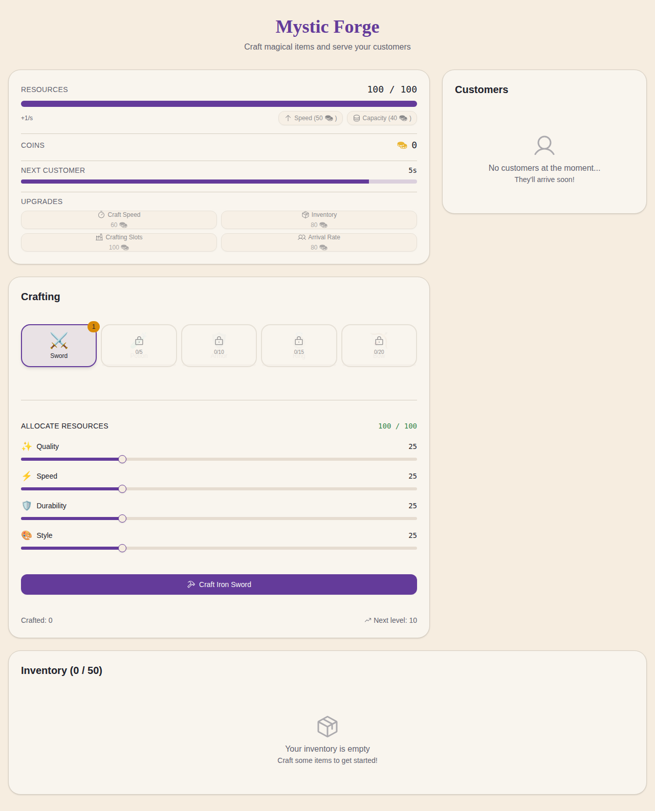

# ✨ Mystic Forge - Idle Crafting Game



A fantasy idle crafting game where you run a magical workshop, craft items with customizable traits, and serve demanding customers!

## 🎮 Game Overview

**Mystic Forge** is an incremental idle game that combines resource management, strategic crafting, and customer service. Allocate your magical resources across different traits to craft legendary items that satisfy your customers' unique preferences.

## 🌟 Key Features

### ⚒️ Strategic Crafting System
- **5 Item Types**: Swords, Potions, Armor, Rings, and Bows
- **Trait Customization**: Allocate resources across Quality, Speed, Durability, and Style
- **Progressive Unlocks**: Unlock new items by crafting previous ones
- **Level System**: Each item has 5 levels that unlock as you craft more

### 🛍️ Customer Management
- **Dynamic Customers**: NPCs arrive periodically with specific item requests
- **Trait Preferences**: Match customer demands with the right trait combinations
- **Customer Progression**: Customers level up and become more demanding over time
- **Reputation System**: Build relationships with returning customers

### 📈 Progression & Upgrades
- **Resource Production**: Upgrade your resource generation rate (1/s → 25/s)
- **Resource Capacity**: Increase maximum storage (100 → 2500)
- **Craft Speed**: Reduce crafting time by up to 70%
- **Crafting Slots**: Work on multiple items simultaneously (1 → 10 slots)
- **Inventory Size**: Expand storage capacity (50 → 1000 slots)
- **Customer Arrival Rate**: Increase customer frequency (20-40s → 6-12s)

### ⏱️ Idle Mechanics
- Resources regenerate automatically while you're away
- Crafting jobs continue progressing based on timestamps
- Return to find completed items and full resources

## 🚀 Getting Started

### Prerequisites
- Node.js (v18 or higher)
- npm or yarn

### Installation

```bash
# Clone the repository
git clone https://github.com/Meir017/trait-crafter-idle.git
cd trait-crafter-idle

# Install dependencies
npm install

# Start the development server
npm run dev
```

The game will be available at `http://localhost:5000/`

### Building for Production

```bash
npm run build
```

## 🎯 How to Play

1. **Craft Your First Item**: Start by selecting the Sword and allocating your 100 resources across the four traits
2. **Serve Customers**: Wait for customers to arrive and sell them items that match their preferences
3. **Earn Coins**: Successful sales earn coins that can be spent on upgrades
4. **Unlock New Items**: Progress through item tiers by crafting the required quantities
5. **Optimize Your Workshop**: Purchase upgrades to craft faster and more efficiently

## 🛠️ Technology Stack

- **React 19** - UI framework
- **TypeScript** - Type-safe development
- **Vite** - Fast build tool and dev server
- **Tailwind CSS** - Utility-first styling
- **Radix UI** - Accessible component primitives
- **Framer Motion** - Smooth animations
- **Vitest** - Unit testing

## 📝 Development

```bash
# Run tests
npm test

# Run linter
npm run lint

# Build project
npm run build

# Preview production build
npm preview
```

## 📄 License

The Spark Template files and resources from GitHub are licensed under the terms of the MIT license, Copyright GitHub, Inc.

## 🎨 Design Philosophy

The game features a cozy fantasy workshop aesthetic with:
- Warm, inviting color palette with deep purples and golden accents
- Clear visual feedback for all actions
- Smooth animations that enhance the magical crafting experience
- Mobile-responsive design for play on any device

## 🤝 Contributing

Contributions are welcome! Feel free to open issues or submit pull requests.

---

**Craft magical items, serve your customers, and build the most legendary forge in the realm! ⚔️✨**
